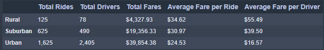
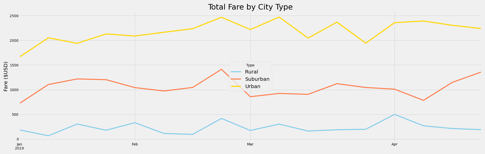

# pyber_analysis

## Overview

### Purpose

The objective of this analysis is to breakdown PyBer ride sharing data by the type of city.
This will help illuminate areas that could be changed or improved upon to increase the success of the company.

## Results

As can be seen from the summary table above the total rides, total number of drivers, and total fares increased when going from rural to suburban to urban city types.
Conversely, the average fare per ride and average fare per driver went down as one goes from rural to suburban to urban city types.

Looking at the time series data of fares for the different city types over the course of the first third of 2019 we can see that urban cities generate the most revenue at approximately $2,300 per week, followed by suburban cities at about $1,100 per week, and finally tailing the end is rural cities at roughly $250 per week.

## Summary
Looking at the summarized data it appears that rural drivers are responsible for 1.6 rides per driver, suburban drivers are responsible for about 1.3 rides per driver, and urban drivers handle 0.68 rides per driver.
This indicates that perhaps the number of urban drivers could be reduced.
I would also recommend looking at the idle time for the drivers as it could be very different for all three city types.
It could be the case that there may not be the need for that many rural drivers.
I'd recommend that you could also increase the fare for the urban drivers as it is lower than the fares generated for both rural and suburban cities.
Increasing the price by $1 per ride would generate close to $2,000.